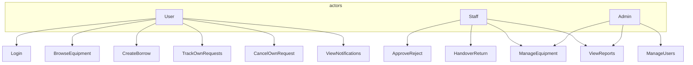
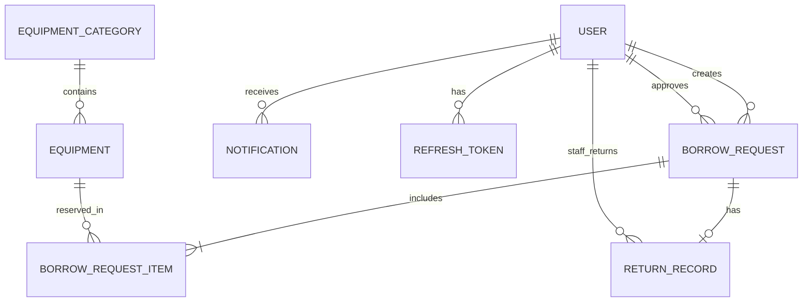
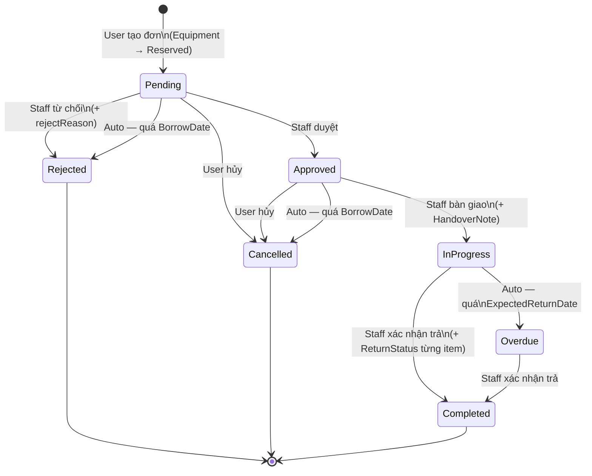
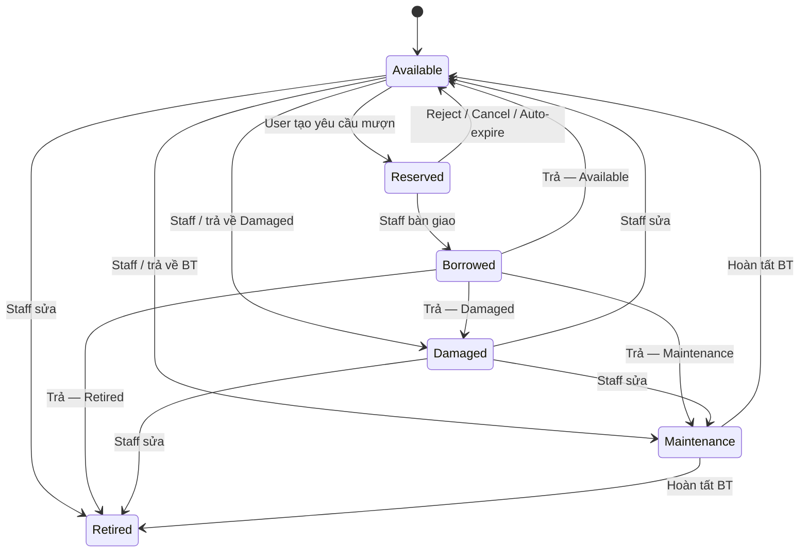
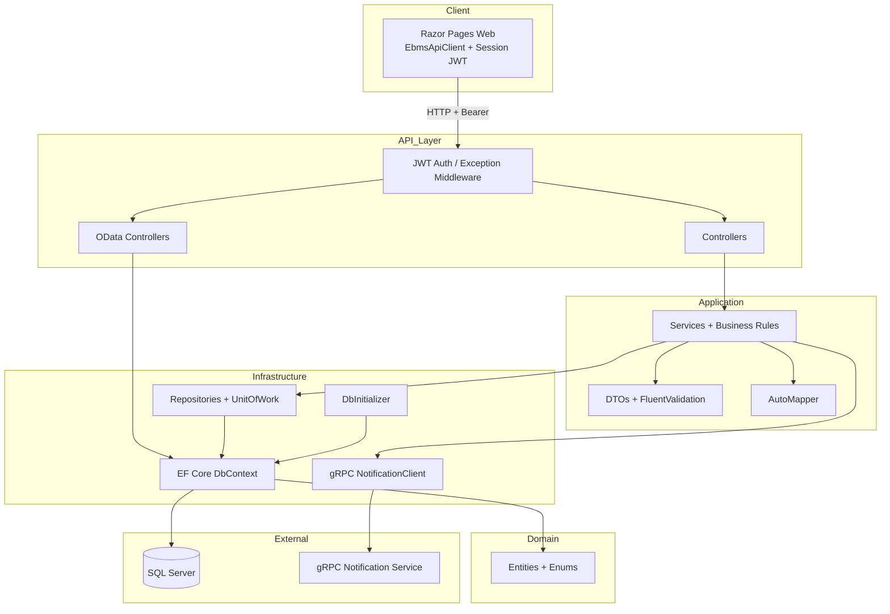

# Equipment Borrowing Management System

**Đề tài:** P1 — Equipment Borrowing Management System  
**Môn học:** PRN232  
**Hình thức:** Project cá nhân  
**Phiên bản tài liệu:** khớp code hiện tại

---

## Mục lục (theo yêu cầu nộp tài liệu §13)

1. [Giới thiệu project](#1-giới-thiệu-project)
2. [Mô tả vai trò người dùng](#2-mô-tả-vai-trò-người-dùng)
3. [Use case](#3-use-case)
4. [ERD / Database schema](#4-erd--database-schema)
5. [Business rules](#5-business-rules)
6. [Workflow](#6-workflow)
7. [Kiến trúc hệ thống](#7-kiến-trúc-hệ-thống)
8. [Service design](#8-service-design)
9. [API endpoint list](#9-api-endpoint-list)
10. [Security matrix](#10-security-matrix)
11. [OData demo](#11-odata-demo)
12. [Content negotiation demo](#12-content-negotiation-demo)
13. [gRPC demo](#13-grpc-demo)
14. [Hướng dẫn chạy project](#14-hướng-dẫn-chạy-project)
15. [Yêu cầu nâng cao đã triển khai](#15-yêu-cầu-nâng-cao-đã-triển-khai)

---

## 1. Giới thiệu project

### 1.1. Tên đề tài và mục tiêu

Xây dựng hệ thống **quản lý mượn / trả / theo dõi thiết bị** trong tổ chức, thể hiện:

- Phân tích bài toán, thiết kế kiến trúc nhiều tầng
- Database + EF Core + migration
- RESTful API, OData, content negotiation (JSON/XML)
- JWT + phân quyền theo role
- Client Razor Pages gọi API
- gRPC service phụ (thông báo email giả lập)
- Workflow trạng thái và business rules rõ ràng

### 1.2. Phạm vi hệ thống

| Trong phạm vi | Ngoài phạm vi |
|---------------|---------------|
| Catalog thiết bị & danh mục | Thanh toán thật |
| Yêu cầu mượn → duyệt → bàn giao → trả | Mobile app native |
| Báo cáo / dashboard | Docker production (khuyến khích, chưa bắt buộc) |
| Thông báo in-app + gRPC simulate email | Audit log (đã bỏ theo quyết định thiết kế) |
| Soft delete, refresh token, FluentValidation | |

### 1.3. Công nghệ

| Thành phần | Công nghệ |
|------------|-----------|
| API | ASP.NET Core Web API (.NET 8) |
| Client | ASP.NET Core Razor Pages |
| DB | SQL Server (LocalDB) + EF Core |
| Auth | JWT + Refresh Token, BCrypt hash |
| Query | OData (`$filter`, `$orderby`, `$top`, `$skip`, `$select`, `$expand`) |
| Mapping | AutoMapper |
| Validation | FluentValidation |
| Service phụ | gRPC `EmailNotificationService` |

### 1.4. Cấu trúc solution

```
src/
  EquipmentBorrowingManagementSystem.Domain/          # Entity, Enum
  EquipmentBorrowingManagementSystem.Application/     # Service, DTO, Validator, Mapping
  EquipmentBorrowingManagementSystem.Infrastructure/  # EF Core, Repository, gRPC client, Seed
  EquipmentBorrowingManagementSystem.Api/             # Controllers, OData, Middleware
  EquipmentBorrowingManagementSystem.Web/             # Razor Pages client
  EquipmentBorrowingManagementSystem.Grpc/            # gRPC notification service
docs/                                                 # Tài liệu + ERD
```

---

## 2. Mô tả vai trò người dùng

| Role | Mô tả | Quyền chính |
|------|-------|-------------|
| **User** | Người mượn thiết bị | Xem catalog; **đăng ký mượn**; theo dõi / hủy đơn của mình; xem thông báo |
| **Staff** | Nhân viên vận hành | **Duyệt / từ chối / bàn giao / nhận trả**; CRUD thiết bị & danh mục; báo cáo |
| **Admin** | Quản trị | CRUD thiết bị & danh mục; **quản lý Users** (tạo Staff, bật/tắt); báo cáo. **Không** tạo yêu cầu mượn. **Không** vào trang Duyệt mượn |

> Khác gợi ý PDF A.1 (Staff/Admin đều duyệt): project này chốt **chỉ Staff** duyệt mượn; Admin tập trung quản trị hệ thống.

---

## 3. Use case

### 3.1. Use case theo vai trò

#### User

| Mã | Use case | Mô tả ngắn |
|----|----------|------------|
| UC-U01 | Đăng ký / Đăng nhập | Tạo tài khoản User hoặc đăng nhập |
| UC-U02 | Xem danh mục & thiết bị | Tìm kiếm, lọc, phân trang thiết bị |
| UC-U03 | Thêm thiết bị vào giỏ mượn | Chỉ thiết bị `Available`; chặn nếu đang Overdue |
| UC-U04 | Gửi yêu cầu mượn | Chọn ngày mượn/trả, mục đích; thiết bị → `Reserved` |
| UC-U05 | Theo dõi yêu cầu | Tab Pending / Chờ bàn giao / Đang mượn / Lịch sử |
| UC-U06 | Hủy yêu cầu | Chỉ khi `Pending` hoặc `Approved` |
| UC-U07 | Xem thông báo | Inbox + đánh dấu đã đọc |

#### Staff

| Mã | Use case | Mô tả ngắn |
|----|----------|------------|
| UC-S01 | Duyệt yêu cầu | Pending → Approved |
| UC-S02 | Từ chối yêu cầu | Pending → Rejected (+ lý do) |
| UC-S03 | Bàn giao thiết bị | Approved → InProgress; ghi `HandoverNote` |
| UC-S04 | Xác nhận trả | InProgress/Overdue → Completed; chọn status từng TB |
| UC-S05 | Quản lý thiết bị/danh mục | CRUD, bảo trì, hoàn tất BT |
| UC-S06 | Xem báo cáo | Dashboard, overdue, borrow-summary |

#### Admin

| Mã | Use case | Mô tả ngắn |
|----|----------|------------|
| UC-A01 | Quản lý Users | Tạo Staff, xem danh sách, kích hoạt/vô hiệu |
| UC-A02 | Quản lý thiết bị/danh mục | Giống Staff |
| UC-A03 | Xem báo cáo | Giống Staff |

### 3.2. Sơ đồ use case tổng quát



---

## 4. ERD / Database schema

File chi tiết: [`docs/ERD.dbml`](ERD.dbml) — import tại [dbdiagram.io](https://dbdiagram.io).

### 4.1. Entity chính (≥ 5)

| Entity | Vai trò |
|--------|---------|
| `User` | Tài khoản + role |
| `EquipmentCategory` | Danh mục thiết bị |
| `Equipment` | Thiết bị + status |
| `BorrowRequest` | Yêu cầu mượn + workflow |
| `BorrowRequestItem` | Chi tiết thiết bị trong đơn (bảng trung gian n-n + thuộc tính) |
| `ReturnRecord` | 1-1 với BorrowRequest khi Completed |
| `Notification` | Thông báo in-app |
| `RefreshToken` | Refresh JWT |

### 4.2. Quan hệ

| Quan hệ | Loại |
|---------|------|
| Category 1 — n Equipment | 1-n |
| User 1 — n BorrowRequest | 1-n |
| BorrowRequest n — n Equipment (qua BorrowRequestItem) | n-n + `HandoverNote`, `ReturnNote`, `ReturnStatus` |
| BorrowRequest 1 — 1 ReturnRecord | 1-1 |
| User 1 — n Notification | 1-n |
| User 1 — n RefreshToken | 1-n |

### 4.3. Sơ đồ quan hệ (tóm tắt)



### 4.4. Trường quan trọng (không còn Quantity / Condition / AuditLog)

- `BorrowRequest.ActualReturnDate` — set khi Completed  
- `BorrowRequestItem.ReturnStatus` — snapshot EquipmentStatus lúc trả  
- Soft delete: `IsDeleted`, `DeletedAt` trên BaseEntity  

---

## 5. Business rules

≥ 5 quy tắc nghiệp vụ (bắt buộc theo đề bài):

| # | Quy tắc | Cách kiểm tra trong hệ thống |
|---|---------|------------------------------|
| BR01 | Thiết bị đang không Available (Reserved/Borrowed/…) không cho mượn tiếp | `EquipmentRules.IsBorrowable` + `HasActiveBorrowingsAsync` |
| BR02 | User đang có đơn `Overdue` không tạo yêu cầu mới | `UserHasOverdueRequestAsync` → 400 + toast UI |
| BR03 | Ngày trả dự kiến ≥ ngày mượn | FluentValidation + service + client |
| BR04 | Chỉ **User** tạo yêu cầu mượn; chỉ **Staff** duyệt/bàn giao/trả | Role check ở service + Web page |
| BR05 | Reject bắt buộc có `rejectReason` | Service + modal UI |
| BR06 | Khi trả, mỗi thiết bị phải chọn status ∈ {Available, Damaged, Maintenance, Retired} | `ParseReturnMap` / `EquipmentRules.IsValidReturnStatus` |
| BR07 | Pending quá `BorrowDate` → auto Rejected; Approved quá `BorrowDate` → auto Cancelled | `ProcessOverdueTransitionsAsync` khi **Staff** GET list/detail |
| BR08 | InProgress quá `ExpectedReturnDate` → Overdue | Cùng trigger khi Staff truy cập (không có background job) |
| BR09 | Borrowed/Reserved không sửa status trực tiếp trên Manage | `IsFlowLocked` |
| BR10 | Chỉ xóa thiết bị Available / Maintenance / Retired / Damaged | `CanDelete` |
| BR11 | User chỉ xem/hủy đơn của chính mình | Filter theo `UserId` |
| BR12 | Password lưu hash (BCrypt), không plain text | `AuthService` / seed |

---

## 6. Workflow

### 6.1. Borrow request



### 6.2. Equipment



### 6.3. Ai được chuyển trạng thái BorrowRequest

| Transition | Ai |
|------------|-----|
| → Pending | User |
| Pending → Approved / Rejected | Staff |
| Approved → InProgress | Staff |
| InProgress / Overdue → Completed | Staff |
| Pending / Approved → Cancelled | User (chủ đơn) |
| Auto Rejected / Cancelled / Overdue | Hệ thống |

### 6.4. Ghi chú thống nhất

| Trường | Entity | Khi nào |
|--------|--------|---------|
| `HandoverNote` | Item | Staff bàn giao |
| `ReturnNote` | Item | Staff trả từng TB |
| `ReturnStatus` | Item | Staff trả (bắt buộc) |
| `StaffNote` | ReturnRecord | Staff trả (tùy chọn) |
| `RejectReason` | BorrowRequest | Staff / hệ thống |
| `ActualReturnDate` | BorrowRequest | Completed |

---

## 7. Kiến trúc hệ thống

### 7.1. Sơ đồ tầng



### 7.2. Trách nhiệm từng tầng

| Tầng | Trách nhiệm |
|------|-------------|
| **Api** | Controller nhận request, HTTP status, `[Authorize]`, OData, content negotiation |
| **Application** | Use case, business rules, validation, DTO, mapping |
| **Infrastructure** | EF Core, Repository, JWT helpers, gRPC client, seed |
| **Domain** | Entity, enum — không phụ thuộc infrastructure |
| **Web** | UI + gọi API (không chứa business rule phức tạp) |

Controller **không** chứa logic nghiệp vụ phức tạp — chỉ gọi service và map `Result` → status code.

---

## 8. Service design

| Service | Trách nhiệm |
|---------|-------------|
| `AuthService` | Register, login, refresh, logout; hash password; phát JWT |
| `UserService` | Admin CRUD User / tạo Staff / bật-tắt `IsActive` |
| `EquipmentService` | CRUD thiết bị, filter/paging, transition status, soft delete |
| `EquipmentCategoryService` | CRUD danh mục |
| `BorrowRequestService` | Tạo/duyệt/từ chối/hủy/bàn giao/trả; auto overdue khi Staff GET; rule Overdue block |
| `ReportService` | Dashboard, borrow-summary, overdue-requests |
| `NotificationService` | Ghi notification DB + gọi gRPC (non-blocking) |

> Return flow nằm trong `BorrowRequestService` (`ReturnAsync`) thay vì tách `ReturnService` riêng — vẫn rõ trách nhiệm theo aggregate BorrowRequest.

**Auto-transition:** `ProcessOverdueTransitionsAsync` chỉ chạy khi **Staff** gọi `GET /api/borrow-requests` (hoặc detail / OData BorrowRequests với token Staff) — không còn background hosted service.
---

## 9. API endpoint list

### 9.1. Auth (`/api/auth`) — anonymous

| Method | Route | Mô tả |
|--------|-------|-------|
| POST | `/api/auth/register` | Đăng ký User |
| POST | `/api/auth/login` | Đăng nhập → access + refresh token |
| POST | `/api/auth/refresh` | Làm mới token |
| POST | `/api/auth/logout` | Thu hồi refresh token |

### 9.2. Users — Admin only

| Method | Route | Role |
|--------|-------|------|
| GET | `/api/users` | Admin |
| GET | `/api/users/{id}` | Admin |
| POST | `/api/users` | Admin (tạo Staff) |
| PATCH | `/api/users/{id}` | Admin (`isActive`) |

### 9.3. Equipment categories

| Method | Route | Role |
|--------|-------|------|
| GET | `/api/equipment-categories` | Authenticated |
| GET | `/api/equipment-categories/{id}` | Authenticated |
| POST / PUT / DELETE | `/api/equipment-categories`… | Staff, Admin |

### 9.4. Equipment

| Method | Route | Role |
|--------|-------|------|
| GET | `/api/equipment` | Authenticated (search, filter, sort, paging) |
| GET | `/api/equipment/{id}` | Authenticated |
| POST / PUT / DELETE | `/api/equipment`… | Staff, Admin |

`[Produces("application/json","application/xml")]` trên `EquipmentController`.

### 9.5. Borrow requests

| Method | Route | Ai / ghi chú |
|--------|-------|--------------|
| GET | `/api/borrow-requests` | User: đơn của mình; Staff: tất cả + chạy auto-overdue |
| GET | `/api/borrow-requests/{id}` | Chủ đơn hoặc Staff |
| POST | `/api/borrow-requests` | **User only** (service) |
| PATCH | `/api/borrow-requests/{id}` | Body `status`: Approved/Rejected/Cancelled/InProgress/Completed — quyền theo service |

### 9.6. Reports — Staff, Admin

| Method | Route |
|--------|-------|
| GET | `/api/reports/dashboard` |
| GET | `/api/reports/overdue-requests` |
| GET | `/api/reports/borrow-summary` |

### 9.7. Notifications — Authenticated

| Method | Route |
|--------|-------|
| GET | `/api/notifications` |
| PATCH | `/api/notifications/{id}/read` |

### 9.8. HTTP status code

`200` / `201` / `204` / `400` / `401` / `403` / `404` / `409` — qua `Result` + `ApiControllerBase.ToActionResult`.

DTO dùng cho request/response; **không** trả password hash hay entity thô ra client.

---

## 10. Security matrix

| Chức năng / API | Admin | Staff | User |
|-----------------|:-----:|:-----:|:----:|
| Đăng ký / đăng nhập | ✓ | ✓ | ✓ |
| Quản lý Users | ✓ | ✗ | ✗ |
| CRUD danh mục / thiết bị | ✓ | ✓ | ✗ (chỉ xem GET) |
| **Tạo yêu cầu mượn** | ✗ | ✗ | ✓ |
| Xem / hủy đơn của mình | ✗* | ✗* | ✓ |
| **Duyệt / từ chối / bàn giao / trả** | ✗ | ✓ | ✗ |
| Vào trang `/Borrow` | ✗ | ✓ | ✓ |
| Báo cáo | ✓ | ✓ | ✗ |
| Thông báo cá nhân | ✓ | ✓ | ✓ |

\* Staff xem **tất cả** đơn trên API list để vận hành; Admin không vào page Duyệt mượn.

**Cơ chế bảo mật:**

- JWT Bearer trên mọi API (trừ auth)
- `[Authorize(Roles = …)]` ở controller + kiểm tra nghiệp vụ trong service
- Password BCrypt
- Refresh token (lưu DB, revoke khi logout)

---

## 11. OData demo

Hai entity set OData (bắt buộc ≥ 2):

| Endpoint | Mô tả |
|----------|-------|
| `GET /odata/Equipment` | Thiết bị + `$expand=category` |
| `GET /odata/BorrowRequests` | Yêu cầu mượn + `$expand=items`; User chỉ thấy đơn mình |

### Ví dụ request (cần JWT)

```http
GET /odata/Equipment?$filter=status eq EquipmentBorrowingManagementSystem.Domain.Enums.EquipmentStatus'Available'&$orderby=name&$top=10
Authorization: Bearer <token>
```

```http
GET /odata/Equipment?$select=id,name,status&$expand=category&$top=5
Authorization: Bearer <token>
```

```http
GET /odata/BorrowRequests?$filter=status eq EquipmentBorrowingManagementSystem.Domain.Enums.BorrowRequestStatus'Pending'&$orderby=requestDate desc
Authorization: Bearer <token>
```

```http
GET /odata/BorrowRequests?$expand=items&$top=5
Authorization: Bearer <token>
```

Demo qua Swagger hoặc Postman (không có trang UI). Authorize JWT rồi gọi `/odata/Equipment` / `/odata/BorrowRequests`.

> REST `/api/equipment?...` và OData `/odata/Equipment?...` là hai kênh khác nhau — query OData không áp vào REST.

---

## 12. Content negotiation demo

- Đăng ký XML: `.AddXmlSerializerFormatters()` trong `Program.cs`
- `EquipmentController` có `[Produces]` / `[Consumes]` cho JSON và XML

### JSON

```http
GET /api/equipment
Accept: application/json
Authorization: Bearer <token>
```

### XML

```http
GET /api/equipment
Accept: application/xml
Authorization: Bearer <token>
```

**Giải thích ngắn:**

| Thành phần | Vai trò |
|------------|---------|
| `Accept` | Client nói muốn nhận format nào (output negotiation) |
| `Content-Type` | Body request đang gửi là format nào (input) |
| Output formatter | Serialize response (JSON/XML) |
| Input formatter | Deserialize request body |

---

## 13. gRPC demo

### Service phụ

| Mục | Chi tiết |
|-----|----------|
| Project | `src/EquipmentBorrowingManagementSystem.Grpc` |
| Proto | `EmailNotificationService.Send(NotificationRequest)` |
| Port | `http://localhost:5272` |
| Hành vi | Log simulate gửi email ra console |

### Cách API gọi

1. `NotificationService.NotifyAsync` ghi bảng `Notifications`
2. Gọi `INotificationClient.SendAsync` (gRPC) **non-blocking**
3. Lỗi gRPC → log warning; API vẫn thành công

### Trigger

Approve / Reject / Handover / Return / Auto-reject / Auto-cancel / Overdue.

Không có trang demo UI — gRPC chạy ngầm khi `NotifyAsync` được gọi. Kiểm tra bằng log console của project Grpc khi Staff duyệt/từ chối/…

Config API: `GrpcNotification:Address` trong `appsettings.json`.

---

## 14. Hướng dẫn chạy project

### 14.1. Yêu cầu môi trường

- .NET 8 SDK  
- SQL Server LocalDB (hoặc chỉnh connection string)  
- (Khuyến nghị) 3 terminal riêng cho Grpc / Api / Web  

### 14.2. Connection string

`src/EquipmentBorrowingManagementSystem.Api/appsettings.json`:

```json
"ConnectionStrings": {
  "DefaultConnection": "Server=(localdb)\\mssqllocaldb;Database=EquipmentBorrowingDb;Trusted_Connection=True;TrustServerCertificate=True;"
}
```

Web gọi API qua `ApiBaseUrl` (mặc định `http://localhost:5171`).

### 14.3. Chạy lần lượt

```bash
# 1. gRPC notification
dotnet run --project src/EquipmentBorrowingManagementSystem.Grpc --launch-profile http

# 2. API (migrate + seed tự chạy khi start)
dotnet run --project src/EquipmentBorrowingManagementSystem.Api --launch-profile http

# 3. Web client
dotnet run --project src/EquipmentBorrowingManagementSystem.Web --launch-profile http
```

| Service | URL |
|---------|-----|
| API + Swagger | http://localhost:5171/swagger |
| Web | http://localhost:5172 |
| gRPC | http://localhost:5272 |

Migration nằm trong `Infrastructure/Data/Migrations`. API start sẽ apply DB + **truncate & seed** dữ liệu demo.

### 14.4. Tài khoản mẫu

| Role | Email | Password |
|------|-------|----------|
| Admin | `admin@ebms.local` | `Admin@123` |
| Staff | `staff@ebms.local` | `Staff@123` |
| User | `user@ebms.local` | `User@123` |

### 14.5. Kiểm tra nhanh sau khi chạy

1. Login User → Equipments → (nếu có Overdue thì toast chặn mượn)  
2. Login Staff → Duyệt mượn → duyệt / bàn giao / trả  
3. Login Admin → Users + Manage (không thấy menu Duyệt mượn)  
4. Swagger: `Accept: application/xml` trên GET equipment  
5. Swagger/Postman: `/odata/Equipment?$top=5` (Authorize JWT trước)  
6. Console gRPC: thấy log email giả lập khi Staff duyệt  

Chi tiết test case: [`docs/MANUAL_TEST_CHECKLIST.md`](MANUAL_TEST_CHECKLIST.md)  
Map trang ↔ API: [`docs/API_PAGE_MAPPING.md`](API_PAGE_MAPPING.md)

---

## 15. Yêu cầu nâng cao đã triển khai

| Mục khuyến khích (PDF §15) | Trạng thái |
|----------------------------|------------|
| Refresh token | ✓ |
| Soft delete | ✓ |
| Pagination chuẩn hóa | ✓ (equipment) |
| Global exception / Result pattern | ✓ (`Result<T>`) |
| AutoMapper | ✓ |
| Repository + Unit of Work | ✓ |
| FluentValidation | ✓ |
| Thông báo giả lập (gRPC + in-app) | ✓ |
| Dashboard thống kê | ✓ |
| Audit log | ✗ (đã loại bỏ có chủ đích) |
| Docker / Serilog | ✗ (chưa) |

---

## Phụ lục — Tài liệu liên quan

| File | Nội dung |
|------|----------|
| [`ERD.dbml`](ERD.dbml) | Schema đầy đủ cho dbdiagram.io |
| [`API_PAGE_MAPPING.md`](API_PAGE_MAPPING.md) | Map Razor page ↔ API |
| [`PROJECT_STATE.md`](PROJECT_STATE.md) | Snapshot quyết định thiết kế |
| [`MANUAL_TEST_CHECKLIST.md`](MANUAL_TEST_CHECKLIST.md) | Checklist test thủ công |
