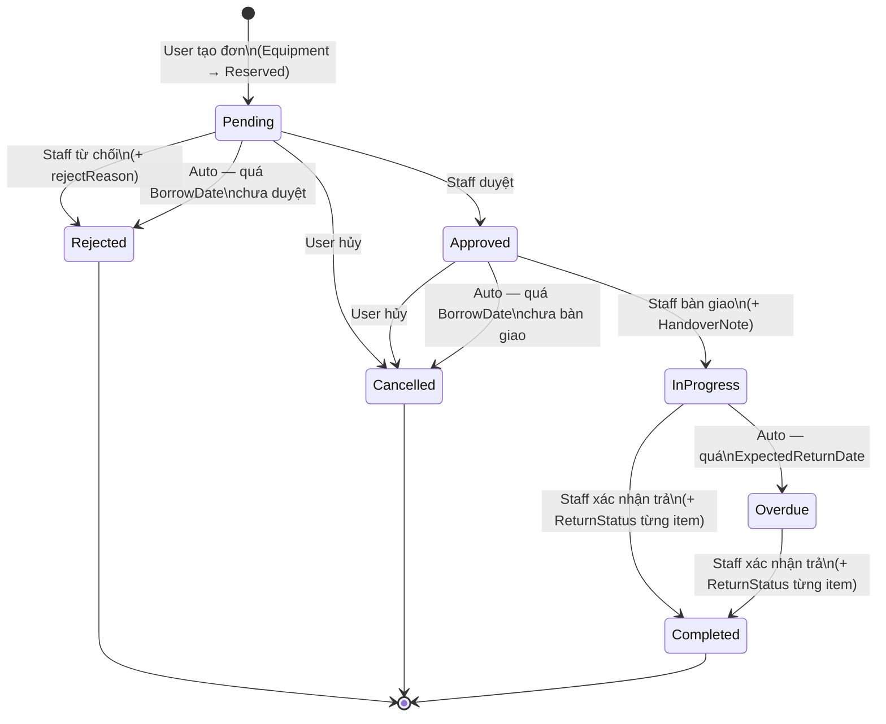
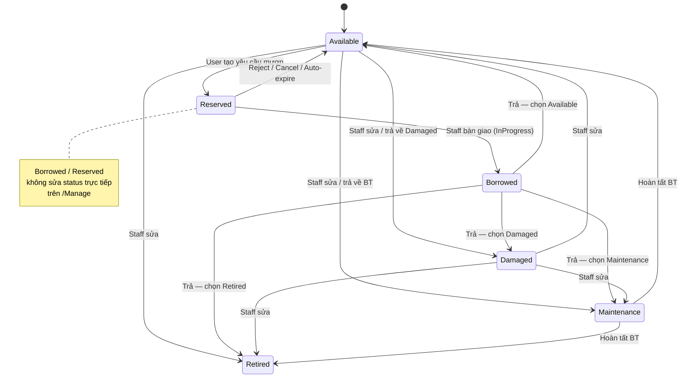

# Equipment Borrowing Management System

**Đề tài:** P1 - PRN232  
**Tài liệu:** cập nhật theo code hiện tại (status-only, phân quyền User/Staff/Admin tách bạch).

## 1. Tổng quan

Hệ thống quản lý mượn/trả thiết bị với 3 vai trò:

| Vai trò | Mô tả |
|---------|-------|
| `User` | **Chỉ User** được đăng ký mượn thiết bị, theo dõi/hủy đơn của mình |
| `Staff` | **Chỉ Staff** được duyệt / từ chối / bàn giao / nhận trả; quản lý thiết bị & danh mục; báo cáo |
| `Admin` | Quản lý thiết bị & danh mục + Users; **không** vào trang Duyệt mượn; **không** tạo yêu cầu mượn |

Công nghệ:

- ASP.NET Core Web API (.NET 8) — Domain / Application / Infrastructure / Api
- Razor Pages Web (`src/EquipmentBorrowingManagementSystem.Web`) gọi API qua `EbmsApiClient`
- SQL Server + EF Core migrations
- JWT + Refresh Token
- OData (`/odata/Equipment`, `/odata/BorrowRequests`), JSON/XML content negotiation
- Soft delete trên entity; **không còn** AuditLog
- gRPC `EmailNotificationService` (project riêng; API gọi khi có thông báo)

## 2. Trạng thái hệ thống

`EquipmentStatus`:

| Giá trị | Ý nghĩa |
|---------|---------|
| `Available` | Sẵn sàng mượn |
| `Reserved` | Đang giữ chỗ trong đơn Pending/Approved |
| `Borrowed` | Đã bàn giao, đang mang đi |
| `Damaged` | Hỏng (sau trả hoặc staff set) |
| `Maintenance` | Đang bảo trì |
| `Retired` | Ngừng sử dụng |

> Đã bỏ `Lost` / `Compensated`. Không còn trường `Quantity` trên item.

`BorrowRequestStatus`:

| Giá trị | Ý nghĩa |
|---------|---------|
| `Pending` | Chờ duyệt |
| `Approved` | Đã duyệt, chờ bàn giao |
| `Rejected` | Từ chối (staff hoặc auto quá `BorrowDate`) |
| `Cancelled` | Hủy (user hoặc auto quá `BorrowDate` chưa bàn giao) |
| `InProgress` | Đã bàn giao, đang mượn |
| `Overdue` | Quá `ExpectedReturnDate` chưa trả |
| `Completed` | Đã trả xong |

## 3. Nghiệp vụ chính

1. **Tạo yêu cầu** (`POST /api/borrow-requests`) — **chỉ User**
   - Thiết bị phải `Available`; sau tạo → `Reserved`
   - Không có `quantity` (mỗi item = 1 thiết bị theo serial)
   - Nếu user đang có đơn `Overdue` → **400** + toast UI
2. **Duyệt** (`PATCH status=Approved`) — **chỉ Staff**  
   Pending → Approved; thiết bị vẫn `Reserved`
3. **Từ chối** (`PATCH status=Rejected` + `rejectReason`) — **chỉ Staff**  
   Reserved → Available
4. **Hủy** (`PATCH status=Cancelled`) — **chủ đơn (User)** khi Pending/Approved  
   Reserved → Available
5. **Bàn giao** (`PATCH status=InProgress` + `items[].note`) — **chỉ Staff**  
   Ghi `HandoverNote` từng item; Reserved → Borrowed
6. **Trả** (`PATCH status=Completed` + `items[].status` + `items[].note` + `staffNote`) — **chỉ Staff**
   - Mỗi item bắt buộc chọn `status` ∈ {Available, Damaged, Maintenance, Retired}
   - Lưu `ReturnNote`, `ReturnStatus` (snapshot), `ActualReturnDate`, `ReturnRecord.StaffNote`
7. **Tự động quá hạn** (so với ngày, chạy khi GET danh sách/chi tiết, khi tạo đơn, và hosted service mỗi giờ):
   - Pending + quá `BorrowDate` → **Rejected** (lý do hệ thống) + release Reserved
   - Approved + quá `BorrowDate` chưa bàn giao → **Cancelled** + release Reserved
   - InProgress + quá `ExpectedReturnDate` → **Overdue**
8. **Sửa thiết bị** (`PUT /api/equipment/{id}`) — Staff/Admin
   - Staff settable: Available / Maintenance / Retired / Damaged
   - Borrowed / Reserved chỉ đổi qua flow mượn-trả
   - Hoàn tất bảo trì: chọn Available hoặc Retired
9. **Xóa thiết bị**: chỉ khi Available / Maintenance / Retired / Damaged (không xóa Reserved/Borrowed)

### Ghi chú (notes) — thống nhất

| Trường | Lưu ở | Ai ghi | Hiển thị |
|--------|-------|--------|----------|
| `HandoverNote` | `BorrowRequestItem` | Staff lúc bàn giao | Chi tiết đơn |
| `ReturnNote` | `BorrowRequestItem` | Staff lúc trả từng TB | Chi tiết đơn |
| `ReturnStatus` | `BorrowRequestItem` | Staff lúc trả (bắt buộc) | Chi tiết / lịch sử |
| `StaffNote` | `ReturnRecord` | Staff lúc trả (tùy chọn, ghi chú tổng) | Chi tiết đơn |
| `RejectReason` | `BorrowRequest` | Staff / hệ thống auto-reject | Chi tiết đơn |
| `ActualReturnDate` | `BorrowRequest` | Hệ thống lúc Completed | Danh sách + chi tiết |

## 4. API REST (tóm tắt)

Auth: `POST /api/auth/{register,login,refresh,logout}`  
Users (Admin): `GET/POST /api/users`, `GET/PATCH /api/users/{id}`  
Equipment (Staff/Admin ghi): `GET/POST/PUT/DELETE /api/equipment`  
Categories: `GET/POST/PUT/DELETE /api/equipment-categories`  
Borrow: `GET/POST /api/borrow-requests`, `GET/PATCH /api/borrow-requests/{id}`  
Reports (Staff/Admin): `GET /api/reports/{dashboard,overdue-requests,borrow-summary}`  
Notifications: `GET /api/notifications`, `PATCH /api/notifications/{id}/read`

## 5. State chart hiện tại

### Borrow request workflow



### Equipment workflow



### Ai được chuyển trạng thái BorrowRequest

| Transition | Ai thực hiện |
|------------|--------------|
| (tạo) → Pending | **User** only |
| Pending → Approved / Rejected | **Staff** only |
| Approved → InProgress | **Staff** only |
| InProgress / Overdue → Completed | **Staff** only |
| Pending / Approved → Cancelled | User (chủ đơn) |
| Pending → Rejected (auto) | Hệ thống (quá `BorrowDate`) |
| Approved → Cancelled (auto) | Hệ thống (quá `BorrowDate`) |
| InProgress → Overdue (auto) | Hệ thống (quá `ExpectedReturnDate`) |

## 6. ERD

Xem [`docs/ERD.dbml`](ERD.dbml) (import [dbdiagram.io](https://dbdiagram.io)).

Thay đổi schema so với bản cũ:

- **Bỏ** `borrow_request_items.quantity`
- **Thêm** `borrow_requests.actual_return_date`
- **Thêm** `borrow_request_items.return_status`
- **Bỏ** bảng `audit_logs`
- **Bỏ** mọi cột Condition legacy

## 7. Web UI (Razor)

| Trang | Ai vào | Ghi chú |
|-------|--------|---------|
| `/Equipment` | Tất cả | Nút Mượn / giỏ chỉ hiện với **User**; chặn + toast nếu đang Overdue |
| `/Borrow` | User + Staff | Admin **bị chặn**; Staff = Duyệt mượn |
| `/Manage` | Staff + Admin | CRUD thiết bị/danh mục; hoàn tất BT modal Available/Retired |
| `/Reports`, `/ODataExplorer`, `/GrpcTools` | Staff + Admin | |
| `/Users` | Admin | |
| `/Notifications` | Tất cả | Chuông hiển thị **số chưa đọc** |

Toast toàn cục (`TempData` → `_Layout`) cho success/error sau mọi thao tác quan trọng.

## 8. Thông báo (in-app + gRPC)

| Sự kiện | Type | Người nhận |
|---------|------|------------|
| Duyệt | `RequestApproved` | User chủ đơn |
| Từ chối / auto-reject | `RequestRejected` | User |
| Bàn giao | `General` | User |
| Trả xong | `EquipmentReturned` | User |
| Auto-cancel (quá BorrowDate) | `RequestRejected` | User |
| Auto Overdue | `RequestOverdue` | User |

gRPC simulate email; lỗi gRPC chỉ log warning, API vẫn thành công.

## 9. Chạy local

```bash
dotnet run --project src/EquipmentBorrowingManagementSystem.Grpc --launch-profile http
dotnet run --project src/EquipmentBorrowingManagementSystem.Api --launch-profile http
dotnet run --project src/EquipmentBorrowingManagementSystem.Web --launch-profile http
```

Seed mỗi lần khởi động API (truncate + seed): `admin@ebms.local` / `staff@ebms.local` / `user@ebms.local`.
