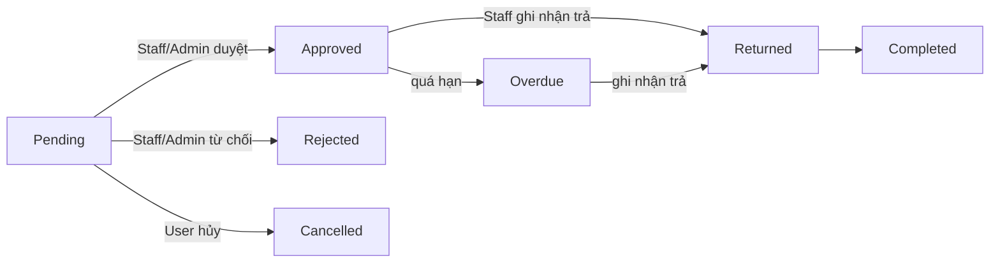
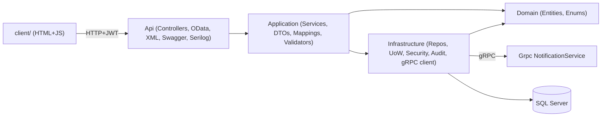

# Equipment Borrowing Management System

**Đề tài:** P1 — PRN232

> Tài liệu mô tả phân tích & thiết kế hệ thống. Phần triển khai được thực hiện theo các slice (xem kế hoạch dự án); những mục đánh dấu _(planned)_ sẽ hoàn thiện ở slice tương ứng.

## 1. Giới thiệu

Hệ thống quản lý việc mượn, trả và theo dõi thiết bị trong một tổ chức. Người dùng gửi yêu cầu mượn thiết bị; nhân viên (Staff) duyệt/từ chối, ghi nhận trả và cập nhật tình trạng thiết bị; quản trị viên (Admin) quản lý danh mục, người dùng và xem báo cáo.

- **Backend:** ASP.NET Core Web API (.NET 8), kiến trúc nhiều tầng (Domain / Application / Infrastructure / Api).
- **CSDL:** SQL Server + Entity Framework Core (Code First, migrations).
- **Bảo mật:** JWT, 3 vai trò (Admin/Staff/User), mật khẩu hash bằng BCrypt.
- **Khác:** OData, content negotiation (JSON/XML), gRPC NotificationService, client HTML/CSS/JS.
- **Phạm vi:** Mượn thiết bị **miễn phí** — không có phí mượn, không phụ phí/đền bù khi mất/hỏng. Mất/hỏng chỉ xử lý qua trạng thái thiết bị.

## 2. Vai trò người dùng

| Vai trò | Quyền chính |
|---|---|
| Admin | Quản lý người dùng, danh mục, thiết bị; duyệt/từ chối yêu cầu; ghi nhận trả; xem báo cáo; xem audit log |
| Staff | Quản lý danh mục, thiết bị; duyệt/từ chối yêu cầu; ghi nhận trả; xem báo cáo |
| User | Gửi/hủy yêu cầu mượn; xem thiết bị; xem lịch sử & thông báo của mình; cập nhật thông tin cá nhân |

## 3. Use case & nghiệp vụ

### Auth (chưa đăng nhập)
- **UC-A1 Đăng ký:** email unique; mật khẩu hash; role mặc định `User`; `IsActive = true`.
- **UC-A2 Đăng nhập:** xác thực email + mật khẩu; tài khoản bị khóa (`IsActive = false`) bị từ chối; trả JWT (userId + role) + refresh token.
- **UC-A3 Làm mới token:** refresh token còn hiệu lực & chưa thu hồi; xoay vòng token (cấp mới, vô hiệu cái cũ).

### Admin
- **UC-AD1 Quản lý người dùng:** Admin tạo tài khoản **Staff**, bật/tắt `IsActive` (activate/deactivate). User thường tự đăng ký qua `/api/auth/register`. Nghiệp vụ: chỉ Admin; email unique; không tự deactivate chính mình; **không xóa user**; không lộ `PasswordHash`.
- **UC-AD2 Xem audit log:** chỉ đọc; ghi tự động kèm người thực hiện + thời điểm.
- Admin kế thừa toàn bộ use case của Staff và User.

### Staff (và Admin)
- **UC-S1 Quản lý danh mục (CRUD):** tên unique; không xóa danh mục còn thiết bị.
- **UC-S2 Quản lý thiết bị (CRUD):** đặt trạng thái `Available/Borrowed/Maintenance/Retired`. Nghiệp vụ: `SerialNumber` unique; không xóa thiết bị đang có yêu cầu còn hiệu lực; xóa là soft delete.
- **UC-S3 Duyệt yêu cầu:** `Pending → Approved`; chỉ Staff/Admin; chỉ với yêu cầu `Pending`; ghi người duyệt + thời điểm; sinh thông báo.
- **UC-S4 Từ chối yêu cầu:** `Pending → Rejected`; bắt buộc `RejectReason`; sinh thông báo.
- **UC-S5 Ghi nhận trả thiết bị:** kiểm tra tình trạng từng thiết bị khi trả — chi tiết ở Business rule 5 (Mục 5).
- **UC-S6 Báo cáo & dashboard:** `borrow-summary`, `overdue-requests`, `dashboard`; chỉ Staff/Admin.

### User (và mọi người đã đăng nhập)
- **UC-U1 Xem/tìm kiếm thiết bị:** tìm theo tên/serial, lọc danh mục/trạng thái, sắp xếp, phân trang.
- **UC-U2 Gửi yêu cầu mượn:** xem business rules 1, 2, 4.
- **UC-U3 Hủy yêu cầu của mình:** `Pending → Cancelled`; chỉ chủ sở hữu; chỉ khi còn `Pending`.
- **UC-U4 Xem lịch sử của mình:** User chỉ thấy yêu cầu của mình; Staff/Admin thấy tất cả.
- **UC-U5 Xem thông báo:** chỉ thông báo của mình; đánh dấu đã đọc.
- **UC-U6 Cập nhật thông tin cá nhân:** không tự đổi role; mật khẩu mới được hash.

## 4. ERD / Database schema

Xem [`ERD.dbml`](ERD.dbml).

**Entity chính (7):** `User`, `EquipmentCategory`, `Equipment`, `BorrowRequest`, `BorrowRequestItem`, `ReturnRecord`, `Notification`.

**Entity bổ sung _(planned, phục vụ bonus)_:** `RefreshToken` (refresh token), `AuditLog` (audit). `BaseEntity` thêm `IsDeleted` + `DeletedAt` cho soft delete.

**Quan hệ:**
- 1-n: `User → BorrowRequest`, `EquipmentCategory → Equipment`, `BorrowRequest → BorrowRequestItem`, `User → Notification`.
- n-n (qua bảng trung gian có thuộc tính): `BorrowRequest ↔ Equipment` qua `BorrowRequestItem` (`Quantity`, `ConditionAtBorrow`, `ConditionAtReturn`).
- 1-1: `BorrowRequest → ReturnRecord`.

## 5. Business rules

1. Thiết bị không ở trạng thái `Available` thì không được thêm vào yêu cầu mượn mới.
2. Người dùng đang có yêu cầu `Overdue` thì không được tạo yêu cầu mới.
3. Duyệt/từ chối chỉ dành cho Staff/Admin và chỉ áp dụng cho yêu cầu `Pending`.
4. `ExpectedReturnDate >= BorrowDate`.
5. **Xử lý khi trả (UC-S5):** ghi `ConditionAtReturn` cho từng item; ánh xạ trạng thái thiết bị: `Good`/`Fair` → `Available`, `Damaged` → `Maintenance`, `Lost` → `Retired`. Tạo `ReturnRecord` với `OverallCondition` = tình trạng xấu nhất trong các item (`Good < Fair < Damaged < Lost`) + ghi chú Staff; yêu cầu chuyển `Completed`. Không có quy trình sửa chữa/đền bù riêng — Staff đưa thiết bị đã sửa về `Available` qua UC-S2.

Quy tắc bổ sung: hủy chỉ khi `Pending` (UC-U3); User chỉ truy cập dữ liệu của chính mình (UC-U4/U5).

## 6. Workflow trạng thái BorrowRequest

## 7. Kiến trúc hệ thống

- **Domain:** entity, enum, không phụ thuộc tầng khác.
- **Application:** use case/service, DTO, mapping (AutoMapper), validation (FluentValidation), `Result` pattern, interface repository/UnitOfWork.
- **Infrastructure:** EF Core `AppDbContext`, repository + Unit of Work, JWT, audit interceptor, gRPC client, seeder.
- **Api:** controller (mỏng), middleware xử lý lỗi tập trung, cấu hình JWT/OData/XML/Swagger/Serilog.

## 8. Service design

| Service | Trách nhiệm |
|---|---|
| AuthService | Đăng ký, đăng nhập, làm mới/thu hồi token, hash mật khẩu |
| UserService | Quản lý người dùng: tạo Staff, activate/deactivate |
| EquipmentCategoryService | CRUD danh mục thiết bị |
| EquipmentService | CRUD thiết bị, tìm kiếm/lọc/sắp xếp/phân trang, cập nhật trạng thái |
| BorrowRequestService | Tạo/hủy/duyệt/từ chối/ghi nhận trả, áp dụng business rules |
| ReportService | Tổng hợp thống kê, dashboard |
| NotificationService | Sinh thông báo (gọi gRPC NotificationService) |

## 9. Danh sách API (planned)

| Method | Route | Quyền |
|---|---|---|
| POST | /api/auth/register | Anonymous |
| POST | /api/auth/login | Anonymous |
| POST | /api/auth/refresh | Anonymous |
| GET | /api/users | Admin |
| POST | /api/users | Admin (tạo Staff; role cố định) |
| PUT | /api/users/{id}/deactivate | Admin |
| PUT | /api/users/{id}/activate | Admin |
| GET | /api/equipment-categories | Authenticated |
| POST/PUT/DELETE | /api/equipment-categories | Admin, Staff |
| GET | /api/equipment | Authenticated (tìm kiếm/lọc/phân trang) |
| POST/PUT/DELETE | /api/equipment | Admin, Staff |
| POST | /api/borrow-requests | Authenticated |
| PUT | /api/borrow-requests/{id}/approve | Admin, Staff |
| PUT | /api/borrow-requests/{id}/reject | Admin, Staff |
| PUT | /api/borrow-requests/{id}/cancel | Owner |
| PUT | /api/borrow-requests/{id}/return | Admin, Staff |
| GET | /api/borrow-requests | User (của mình) / Admin, Staff (tất cả) |
| GET | /api/reports/borrow-summary | Admin, Staff |
| GET | /api/reports/overdue-requests | Admin, Staff |
| GET | /api/reports/dashboard | Admin, Staff |
| GET | /api/notifications | Authenticated (của mình) |
| GET | /odata/Equipment | Authenticated (OData) |
| GET | /odata/BorrowRequests | Admin, Staff (OData) |

## 10. Security matrix

| Chức năng | Admin | Staff | User |
|---|---|---|---|
| Quản lý người dùng | Có | Không | Không |
| Quản lý danh mục/thiết bị | Có | Có | Không |
| Gửi yêu cầu mượn | Có | Có | Có |
| Duyệt/từ chối yêu cầu | Có | Có | Không |
| Ghi nhận trả | Có | Có | Không |
| Xem báo cáo/dashboard | Có | Có | Không |
| Xem lịch sử cá nhân | Có | Có | Có (chỉ của mình) |
| Xem audit log | Có | Không | Không |

## 11. OData demo

Ba endpoint OData doc lap REST (chi JSON):

- `GET /odata/EquipmentCategories?$expand=equipments&$filter=equipments/any(e: e/status eq 'Available')`
- `GET /odata/ReturnRecords?$expand=borrowRequest&$orderby=returnDate desc`
- `GET /odata/BorrowRequestItems?$filter=conditionAtReturn eq 'Damaged'&$expand=equipment,borrowRequest`

## 12. Content negotiation demo

Equipment REST (`/api/equipment`) ho tro JSON va XML qua header `Accept` / `Content-Type`:

- `GET /api/equipment` với `Accept: application/json` → JSON (`PagedResult`).
- `GET /api/equipment` với `Accept: application/xml` → XML (`<PagedResult><Item>...</Item></PagedResult>`).
- `GET /api/equipment/{id}` với `Accept: application/xml` → XML (`<Equipment>...</Equipment>`).
- `POST`/`PUT` với `Content-Type: application/xml` → body XML (Staff/Admin).

OData endpoints luôn trả JSON (`[Produces("application/json")]`).

## 13. gRPC demo _(planned — Slice 9)_

gRPC `NotificationService` (project riêng). Web API gọi service này khi duyệt/từ chối/ghi nhận trả để gửi thông báo (giả lập email). Gọi không chặn luồng: nếu gRPC lỗi, API vẫn xử lý thành công và ghi log.

## 14. Hướng dẫn chạy

**Yêu cầu:** .NET 8 SDK, SQL Server (LocalDB hoặc container).

1. Cấu hình chuỗi kết nối trong [`appsettings.json`](../src/EquipmentBorrowingManagementSystem.Api/appsettings.json) (`ConnectionStrings:DefaultConnection`).
2. Chạy API: `dotnet run --project src/EquipmentBorrowingManagementSystem.Api` (tự động migrate + seed dữ liệu mẫu).
3. Mở Swagger tại `https://localhost:<port>/swagger`.
4. _(planned)_ Chạy gRPC service, client HTML/JS, hoặc toàn bộ qua `docker compose up`.

## 15. Tài khoản mẫu (seed)

| Vai trò | Email | Mật khẩu |
|---|---|---|
| Admin | admin@ebms.local | Admin@123 |
| Staff | staff@ebms.local | Staff@123 |
| User | user@ebms.local | User@123 |

## 16. Tính năng nâng cao (Section 15)

Result wrapper, Repository + Unit of Work, AutoMapper, global exception handling, phân trang chuẩn hóa, FluentValidation, thông báo giả lập (gRPC), dashboard thống kê, Serilog logging, refresh token, audit log, soft delete, Docker Compose (SQL + Api + Grpc). Triển khai dần theo các slice.
