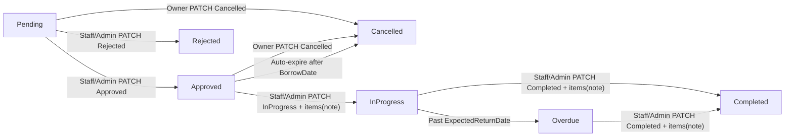
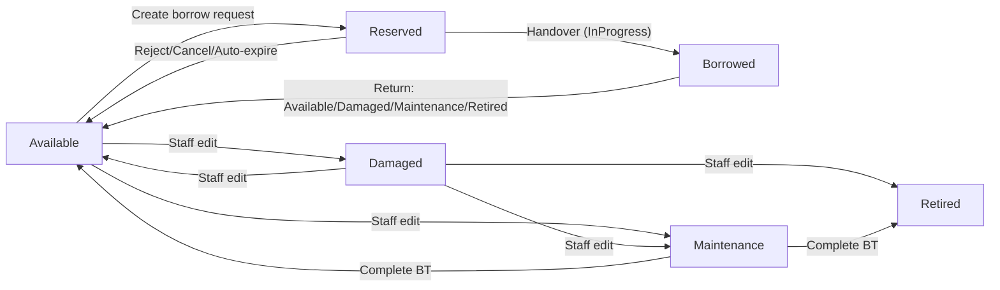

# Equipment Borrowing Management System

**De tai:** P1 - PRN232  
**Tai lieu:** da cap nhat theo mo hinh status-only.

## 1. Tong quan

He thong quan ly muon/tra thiet bi voi 3 vai tro:

| Vai tro | Mo ta |
|---------|-------|
| `User` | Nguoi muon thiet bi — xem catalog, tao yeu cau muon, theo doi don |
| `Staff` | Nhan vien van hanh — **duyet muon**, **ban giao/tra**, **quan ly thiet bi & danh muc**, bao cao |
| `Admin` | Quan tri — toan bo quyen Staff + quan ly tai khoan (tao Staff, kich hoat/vo hieu) |

Cong nghe:

- ASP.NET Core Web API (.NET 8), kien truc Domain/Application/Infrastructure/Api
- SQL Server + EF Core migrations
- JWT + Refresh Token
- Client HTML/CSS/jQuery (`client/`)
- OData, JSON/XML content negotiation, audit log, soft delete
- gRPC `EmailNotificationService` (project rieng, API goi khi approve/reject/return)

## 2. Trang thai he thong

`EquipmentStatus`:

- `Available`, `Borrowed`, `Maintenance`, `Retired`, `Reserved`, `Damaged`

`BorrowRequestStatus`:

- `Pending`, `Approved`, `Rejected`, `Cancelled`, `InProgress`, `Completed`, `Overdue`

## 3. Nghiep vu chinh (status-only)

1. Tao yeu cau muon (`POST /api/borrow-requests`):
   - thiet bi hop le khi `status = Available`
   - tao don xong -> thiet bi `Reserved` ngay
2. Duyet don (`PATCH status=Approved`): chi tu `Pending`, thiet bi phai con `Reserved`.
3. Tu choi/Huy (`Rejected`/`Cancelled`): giai phong `Reserved -> Available`.
4. Ban giao (`PATCH status=InProgress`): ghi `HandoverNote` theo tung item, `Reserved -> Borrowed`.
5. Tra (`PATCH status=Completed`): staff chọn status từng thiết bị (`Available` / `Damaged` / `Maintenance` / `Retired`), ghi `ReturnNote` + `StaffNote`.
6. Auto-expire: don `Approved` qua `BorrowDate` chua ban giao -> auto `Cancelled`, tra thiet bi ve `Available`.
7. Cap nhat thiet bi thu cong (`PUT /api/equipment/{id}`):
   - Staff chi dat: `Available`, `Maintenance`, `Retired`, `Damaged`
   - `Borrowed` / `Reserved` chi doi qua luong muon/tra
   - Hoan tat bao tri: chon `Available` hoac `Retired`

## 4. API REST

Auth:

- `POST /api/auth/register`
- `POST /api/auth/login`
- `POST /api/auth/refresh`
- `POST /api/auth/logout`

Users (Admin):

- `GET /api/users`
- `GET /api/users/{id}`
- `POST /api/users`
- `PATCH /api/users/{id}` (`{ "isActive": true|false }`)

Equipment:

- `GET /api/equipment`
- `GET /api/equipment/{id}`
- `POST /api/equipment`
- `PUT /api/equipment/{id}`
- `DELETE /api/equipment/{id}`

Borrow requests:

- `GET /api/borrow-requests`
- `GET /api/borrow-requests/{id}`
- `POST /api/borrow-requests`
- `PATCH /api/borrow-requests/{id}`

Reports:

- `GET /api/reports/borrow-summary`
- `GET /api/reports/overdue-requests`
- `GET /api/reports/dashboard`

## 5. State chart hien tai

### Borrow request workflow



### Equipment workflow



## 6. ERD

Xem `docs/ERD.dbml`.

Schema hien tai khong con cac cot lien quan condition:

- `equipments.current_condition`
- `borrow_request_items.condition_at_borrow`
- `borrow_request_items.condition_at_return`
- `return_records.overall_condition`

## 7. Client manage/filter

Trang `/Manage` (Razor):

- Filter day du cac status: Available, Borrowed, Maintenance, Reserved, Damaged, Retired
- Hoan tat bao tri mo modal chon Available/Retired
- Link tu dashboard sang trang quan ly dung query `?status=<Status>`

## 8. gRPC NotificationService

Project: `src/EquipmentBorrowingManagementSystem.Grpc`

| Thanh phan | Mo ta |
|---|---|
| Proto | `EmailNotificationService.Send(NotificationRequest)` |
| Server | Log simulate email ra console |
| Client | `Infrastructure/Grpc/NotificationClient` |
| Config | `GrpcNotification:Address` trong API `appsettings.json` |

Chay gRPC service:

```bash
dotnet run --project src/EquipmentBorrowingManagementSystem.Grpc --launch-profile http
```

Chay API (terminal khac):

```bash
dotnet run --project src/EquipmentBorrowingManagementSystem.Api --launch-profile http
```

Khi Staff duyet/tu choi/ghi nhan tra don muon, API vua ghi `Notifications` in-app vua goi gRPC (non-blocking). Neu gRPC service khong chay, API van thanh cong va chi log warning.
