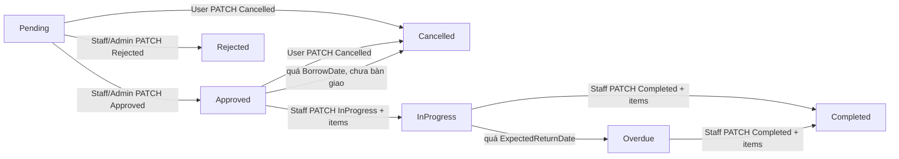
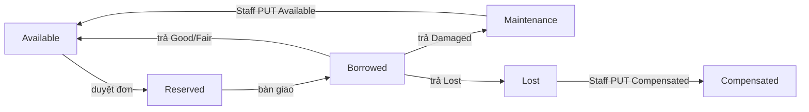
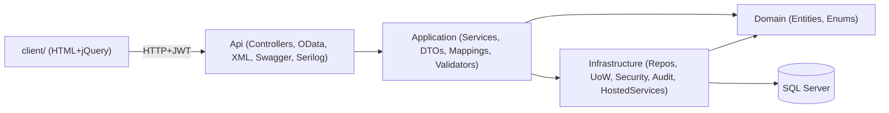

# Equipment Borrowing Management System

**Đề tài:** P1 — PRN232

> Tài liệu mô tả phân tích & thiết kế hệ thống. Phần triển khai theo các vertical slice; mục đánh dấu _(planned)_ chưa có trong code.

## 1. Giới thiệu

Hệ thống quản lý việc mượn, trả và theo dõi thiết bị trong một tổ chức. Người dùng gửi yêu cầu mượn thiết bị; nhân viên (Staff) duyệt/từ chối, bàn giao, ghi nhận trả và cập nhật tình trạng thiết bị; quản trị viên (Admin) quản lý danh mục, người dùng và xem báo cáo.

- **Backend:** ASP.NET Core Web API (.NET 8), kiến trúc nhiều tầng (Domain / Application / Infrastructure / Api).
- **CSDL:** SQL Server + Entity Framework Core (Code First, migrations).
- **Bảo mật:** JWT + refresh token, 3 vai trò (Admin/Staff/User), mật khẩu hash bằng BCrypt.
- **Khác:** OData, content negotiation (JSON/XML), client HTML/CSS/jQuery (`client/`), audit log, soft delete.
- **gRPC NotificationService:** _(planned — Slice 9)_; hiện dùng thông báo in-app qua `NotificationService`.
- **Phạm vi:** Mượn thiết bị **miễn phí** — không có phí mượn. Mất/hỏng xử lý qua trạng thái thiết bị (`Lost` → xác nhận đền bù → `Compensated`, ẩn vĩnh viễn).

## 2. Vai trò người dùng

| Vai trò | Quyền chính |
|---|---|
| Admin | Quản lý người dùng, danh mục, thiết bị; duyệt/từ chối/bàn giao/ghi nhận trả; xem báo cáo; xem audit log |
| Staff | Quản lý danh mục, thiết bị; duyệt/từ chối/bàn giao/ghi nhận trả; xem báo cáo |
| User | Gửi/hủy yêu cầu mượn; xem thiết bị; xem lịch sử mượn của mình |

## 3. Use case & nghiệp vụ

### Auth (chưa đăng nhập)
- **UC-A1 Đăng ký:** `POST /api/auth/register` — email unique; mật khẩu hash; role mặc định `User`; `IsActive = true`.
- **UC-A2 Đăng nhập:** `POST /api/auth/login` — xác thực email + mật khẩu; tài khoản bị khóa (`IsActive = false`) bị từ chối; trả JWT + refresh token.
- **UC-A3 Làm mới token:** `POST /api/auth/refresh` — refresh token còn hiệu lực & chưa thu hồi; xoay vòng token.
- **UC-A4 Đăng xuất:** `POST /api/auth/logout` — thu hồi refresh token.

### Admin
- **UC-AD1 Quản lý người dùng:** Admin tạo tài khoản **Staff** (`POST /api/users`), bật/tắt `IsActive` qua `PATCH /api/users/{id}`. User thường tự đăng ký qua `/api/auth/register`. Chỉ Admin; email unique; không tự deactivate chính mình; **không xóa user**; không lộ `PasswordHash`.
- **UC-AD2 Xem audit log:** `GET /api/audit-logs` — chỉ đọc; ghi tự động kèm người thực hiện + thời điểm.
- Admin kế thừa toàn bộ use case của Staff và User.

### Staff (và Admin)
- **UC-S1 Quản lý danh mục (CRUD):** tên unique; không xóa danh mục còn thiết bị.
- **UC-S2 Quản lý thiết bị (CRUD):** `PUT /api/equipment/{id}` cập nhật metadata + `status` + `currentCondition`. Staff có thể đặt `Available` / `Maintenance` / `Retired` thủ công; `Borrowed` / `Reserved` / `Lost` do luồng mượn quản lý. `SerialNumber` unique; không xóa thiết bị đang có yêu cầu active; xóa là soft delete. Thiết bị `Compensated` ẩn khỏi danh sách.
- **UC-S3 Duyệt yêu cầu:** `PATCH` với `{ "status": "Approved" }` — `Pending → Approved`; thiết bị chuyển `Reserved`; chỉ Staff/Admin; chỉ `Pending`.
- **UC-S4 Từ chối yêu cầu:** `PATCH` với `{ "status": "Rejected", "rejectReason": "..." }` — bắt buộc lý do; sinh thông báo.
- **UC-S5 Bàn giao thiết bị:** `PATCH` với `{ "status": "InProgress", "items": [...] }` — `Approved → InProgress`; ghi `ConditionAtBorrow` + `HandoverNote` từng item; thiết bị → `Borrowed`.
- **UC-S6 Ghi nhận trả:** `PATCH` với `{ "status": "Completed", "staffNote": "...", "items": [...] }` — chi tiết ở Business rule 5.
- **UC-S7 Hoàn tất bảo trì:** `PUT /api/equipment/{id}` — `Maintenance → Available`, `currentCondition` = `Good` hoặc `Fair`.
- **UC-S8 Xác nhận đền bù:** `PUT /api/equipment/{id}` — `Lost → Compensated`, `currentCondition` = `Compensated` (ẩn vĩnh viễn).
- **UC-S9 Báo cáo & dashboard:** `borrow-summary`, `overdue-requests`, `dashboard`; chỉ Staff/Admin.

### User (và mọi người đã đăng nhập)
- **UC-U1 Xem/tìm kiếm thiết bị:** tìm theo tên/serial, lọc danh mục/trạng thái, sắp xếp, phân trang (`GET /api/equipment`).
- **UC-U2 Gửi yêu cầu mượn:** xem business rules 1, 2, 4.
- **UC-U3 Hủy yêu cầu của mình:** `PATCH` với `{ "status": "Cancelled" }` — chỉ chủ sở hữu; chỉ khi `Pending` hoặc `Approved` (chưa bàn giao).
- **UC-U4 Xem lịch sử:** User chỉ thấy yêu cầu của mình; Staff/Admin thấy tất cả (`GET /api/borrow-requests`).
- **UC-U5 Xem thông báo:** _(planned — REST `GET /api/notifications`)_; hiện thông báo được ghi DB khi duyệt/từ chối/trả.

## 4. ERD / Database schema

Xem [`ERD.dbml`](ERD.dbml).

**Entity chính:** `User`, `EquipmentCategory`, `Equipment`, `BorrowRequest`, `BorrowRequestItem`, `ReturnRecord`, `Notification`, `RefreshToken`, `AuditLog`.

**Thuộc tính quan trọng (bổ sung):**
- `Equipment.CurrentCondition` — tình trạng vật lý hiện tại (`Good`/`Fair`/`Damaged`/`Lost`/`Compensated`), tách khỏi `Equipment.Status`.
- `BorrowRequestItem.HandoverNote`, `ReturnNote` — ghi chú bàn giao/trả.
- `BaseEntity.IsDeleted`, `DeletedAt` — soft delete.

**Quan hệ:**
- 1-n: `User → BorrowRequest`, `EquipmentCategory → Equipment`, `BorrowRequest → BorrowRequestItem`, `User → Notification`.
- n-n (qua bảng trung gian có thuộc tính): `BorrowRequest ↔ Equipment` qua `BorrowRequestItem` (`Quantity`, `ConditionAtBorrow`, `ConditionAtReturn`, `HandoverNote`, `ReturnNote`).
- 1-1: `BorrowRequest → ReturnRecord`.

## 5. Business rules

1. Thiết bị chỉ được mượn khi `Status = Available` **và** `CurrentCondition` là `Good` hoặc `Fair`. Client hiển thị cảnh báo khi `Fair`.
2. Người dùng đang có yêu cầu `Overdue` thì không được tạo yêu cầu mới.
3. Duyệt/từ chối/bàn giao/ghi nhận trả chỉ dành cho Staff/Admin. Hủy chỉ chủ đơn, khi `Pending` hoặc `Approved`.
4. `ExpectedReturnDate >= BorrowDate`.
5. **Khi gửi yêu cầu (Pending):** thiết bị → `Reserved` ngay; người khác không thêm được vào đơn mới. Hủy/từ chối → trả về `Available`.
6. **Khi duyệt:** xác nhận thiết bị vẫn `Reserved`; chuyển đơn → `Approved`.
7. **Khi bàn giao:** ghi `ConditionAtBorrow` (Good/Fair/Damaged) + `HandoverNote`; thiết bị → `Borrowed`, `CurrentCondition` = tình trạng lúc bàn giao.
8. **Khi trả:** ghi `ConditionAtReturn` + `ReturnNote` từng item; ánh xạ trạng thái thiết bị:
   - `Good`/`Fair` → `Available`
   - `Damaged` → `Maintenance`
   - `Lost` → `Lost`
   Tạo `ReturnRecord` với `OverallCondition` = tình trạng xấu nhất (`Good < Fair < Damaged < Lost`); yêu cầu → `Completed`.
9. **Tự hủy đơn Approved:** nếu không bàn giao trước `BorrowDate`, job nền hủy đơn và giải phóng `Reserved` → `Available`.
10. **Bảo trì xong:** Staff `PUT` equipment `Maintenance → Available`, condition `Good`/`Fair`.
11. **Đền bù mất:** Staff `PUT` equipment `Lost → Compensated` — thiết bị ẩn khỏi catalog.

## 6. Workflow trạng thái BorrowRequest



**Workflow trạng thái Equipment (trong luồng mượn):**



## 7. Kiến trúc hệ thống



- **Domain:** entity, enum, không phụ thuộc tầng khác.
- **Application:** use case/service, DTO, mapping (AutoMapper), validation (FluentValidation), `Result` pattern, interface repository/UnitOfWork.
- **Infrastructure:** EF Core `AppDbContext`, repository + Unit of Work, JWT, audit interceptor, seeder, `BorrowRequestExpirationHostedService` (tự hủy đơn Approved quá hạn).
- **Api:** controller (mỏng), middleware xử lý lỗi tập trung, cấu hình JWT/OData/XML/Swagger/Serilog/CORS.

## 8. Service design

| Service | Trách nhiệm |
|---|---|
| AuthService | Đăng ký, đăng nhập, làm mới/thu hồi token, hash mật khẩu |
| UserService | Quản lý người dùng: tạo Staff, cập nhật `IsActive` |
| EquipmentCategoryService | CRUD danh mục thiết bị |
| EquipmentService | CRUD thiết bị, tìm kiếm/lọc/sắp xếp/phân trang, validation chuyển trạng thái/condition |
| BorrowRequestService | Tạo yêu cầu; `UpdateAsync` điều phối theo `status` (duyệt/từ chối/hủy/bàn giao/trả); tự hủy Approved quá hạn |
| ReportService | Tổng hợp thống kê, dashboard |
| NotificationService | Sinh thông báo in-app (gRPC _(planned)_) |
| AuditLogService | Đọc audit log (Admin) |

## 9. Danh sách API

Thiết kế REST: thay đổi trạng thái qua `PATCH`/`PUT` trên resource, không dùng URL hành động (`/approve`, `/activate`, …).

### Auth

| Method | Route | Quyền |
|---|---|---|
| POST | /api/auth/register | Anonymous |
| POST | /api/auth/login | Anonymous |
| POST | /api/auth/refresh | Anonymous |
| POST | /api/auth/logout | Authenticated |

### Users

| Method | Route | Quyền |
|---|---|---|
| GET | /api/users | Admin |
| GET | /api/users/{id} | Admin |
| POST | /api/users | Admin (tạo Staff) |
| PATCH | /api/users/{id} | Admin |

Body `PATCH /api/users/{id}`:
```json
{ "isActive": false }
```

### Equipment categories

| Method | Route | Quyền |
|---|---|---|
| GET | /api/equipment-categories | Authenticated |
| GET | /api/equipment-categories/{id} | Authenticated |
| POST | /api/equipment-categories | Admin, Staff |
| PUT | /api/equipment-categories/{id} | Admin, Staff |
| DELETE | /api/equipment-categories/{id} | Admin, Staff |

### Equipment

| Method | Route | Quyền |
|---|---|---|
| GET | /api/equipment | Authenticated (search/filter/sort/paging) |
| GET | /api/equipment/{id} | Authenticated |
| POST | /api/equipment | Admin, Staff |
| PUT | /api/equipment/{id} | Admin, Staff |
| DELETE | /api/equipment/{id} | Admin, Staff |

Body `PUT /api/equipment/{id}` (hoàn tất bảo trì):
```json
{
  "name": "...",
  "serialNumber": "...",
  "categoryId": 1,
  "status": "Available",
  "currentCondition": "Good",
  "location": "...",
  "description": "...",
  "imageUrl": "..."
}
```

Body `PUT /api/equipment/{id}` (xác nhận đền bù):
```json
{
  "status": "Compensated",
  "currentCondition": "Compensated",
  "...": "các field khác giữ nguyên"
}
```

### Borrow requests

| Method | Route | Quyền |
|---|---|---|
| GET | /api/borrow-requests | User (của mình) / Admin, Staff (tất cả) |
| GET | /api/borrow-requests/{id} | User (của mình) / Admin, Staff |
| POST | /api/borrow-requests | Authenticated |
| PATCH | /api/borrow-requests/{id} | Theo transition (xem bảng dưới) |

`PATCH /api/borrow-requests/{id}` — ví dụ body theo transition:

| Transition | Body | Ai được gọi |
|---|---|---|
| Duyệt | `{ "status": "Approved" }` | Admin, Staff |
| Từ chối | `{ "status": "Rejected", "rejectReason": "..." }` | Admin, Staff |
| Hủy | `{ "status": "Cancelled" }` | Chủ đơn |
| Bàn giao | `{ "status": "InProgress", "items": [{ "equipmentId": 1, "conditionAtBorrow": "Good", "note": "..." }] }` | Admin, Staff |
| Trả | `{ "status": "Completed", "staffNote": "...", "items": [{ "equipmentId": 1, "conditionAtReturn": "Good", "note": "..." }] }` | Admin, Staff |

### Reports

| Method | Route | Quyền |
|---|---|---|
| GET | /api/reports/borrow-summary | Admin, Staff |
| GET | /api/reports/overdue-requests | Admin, Staff |
| GET | /api/reports/dashboard | Admin, Staff |

### Audit logs

| Method | Route | Quyền |
|---|---|---|
| GET | /api/audit-logs | Admin |

### Notifications _(planned)_

| Method | Route | Quyền |
|---|---|---|
| GET | /api/notifications | Authenticated (của mình) |
| PATCH | /api/notifications/{id} | Authenticated (đánh dấu đã đọc) |

### OData

| Method | Route | Quyền |
|---|---|---|
| GET | /odata/EquipmentCategories | Authenticated |
| GET | /odata/ReturnRecords | Admin, Staff |
| GET | /odata/BorrowRequestItems | Admin, Staff |

## 10. Security matrix

| Chức năng | Admin | Staff | User |
|---|---|---|---|
| Quản lý người dùng | Có | Không | Không |
| Quản lý danh mục/thiết bị | Có | Có | Không |
| Gửi yêu cầu mượn | Có | Có | Có |
| Duyệt/từ chối/bàn giao/ghi nhận trả | Có | Có | Không |
| Hủy yêu cầu (của mình) | Có | Có | Có |
| Xem báo cáo/dashboard | Có | Có | Không |
| Xem lịch sử mượn | Có (tất cả) | Có (tất cả) | Có (của mình) |
| Xem audit log | Có | Không | Không |

## 11. OData demo

Ba endpoint OData độc lập REST (chỉ JSON):

- `GET /odata/EquipmentCategories?$expand=equipments&$filter=equipments/any(e: e/status eq 'Available')`
- `GET /odata/ReturnRecords?$expand=borrowRequest&$orderby=returnDate desc`
- `GET /odata/BorrowRequestItems?$filter=conditionAtReturn eq 'Damaged'&$expand=equipment,borrowRequest`

## 12. Content negotiation demo

Equipment REST (`/api/equipment`) hỗ trợ JSON và XML qua header `Accept` / `Content-Type`:

- `GET /api/equipment` với `Accept: application/json` → JSON (`PagedResult`).
- `GET /api/equipment` với `Accept: application/xml` → XML (`<PagedResult><Item>...</Item></PagedResult>`).
- `GET /api/equipment/{id}` với `Accept: application/xml` → XML (`<Equipment>...</Equipment>`).
- `POST`/`PUT` với `Content-Type: application/xml` → body XML (Staff/Admin).

OData endpoints luôn trả JSON (`[Produces("application/json")]`).

## 13. gRPC demo _(planned — Slice 9)_

gRPC `NotificationService` (project riêng). Web API gọi service này khi duyệt/từ chối/ghi nhận trả để gửi thông báo (giả lập email). Gọi không chặn luồng: nếu gRPC lỗi, API vẫn xử lý thành công và ghi log.

## 14. Hướng dẫn chạy

**Yêu cầu:** .NET 8 SDK, SQL Server (LocalDB hoặc container).

1. Cấu hình chuỗi kết nối trong [`appsettings.json`](../src/EquipmentBorrowingManagementSystem.Api/appsettings.json) (`ConnectionStrings:DefaultConnection`).
2. Chạy API: `dotnet run --project src/EquipmentBorrowingManagementSystem.Api --launch-profile http` → `http://localhost:5171` (tự động migrate + seed).
3. Mở Swagger tại `http://localhost:5171/swagger`.
4. Mở client: các file HTML trong `client/` (ví dụ `client/login.html`). Cấu hình API base URL tại `client/js/config.js` (`EBMS_CONFIG.API_BASE_URL`).
5. _(planned)_ Chạy gRPC service hoặc toàn bộ qua `docker compose up`.

**Lưu ý build:** nếu API đang chạy, dừng process trước khi `dotnet build` (file lock).

## 15. Tài khoản mẫu (seed)

| Vai trò | Email | Mật khẩu |
|---|---|---|
| Admin | admin@ebms.local | Admin@123 |
| Staff | staff@ebms.local | Staff@123 |
| User | user@ebms.local | User@123 |

## 16. Client (`client/`)

Trang chính:

| Trang | Mô tả |
|---|---|
| `login.html`, `register.html` | Đăng nhập/đăng ký |
| `categories.html` | Trang chủ — danh mục |
| `equipment.html`, `equipment-detail.html` | Danh sách/chi tiết thiết bị, giỏ mượn |
| `borrow.html` | Yêu cầu mượn (tabs: chờ duyệt / chờ bàn giao / đang mượn / lịch sử) |
| `manage.html` | Staff/Admin — CRUD thiết bị, bảo trì, đền bù |
| `categories.html` (manage categories) | Quản lý danh mục |
| `users.html`, `user-detail.html` | Admin — quản lý user |
| `reports.html`, `audit-logs.html` | Báo cáo, audit log |
| `notifications.html` | Placeholder — chờ REST notifications |

Shared JS: `api.js`, `auth.js`, `utils.js`, `borrow-cart.js` (giỏ mượn trong `sessionStorage`).

## 17. Tính năng nâng cao (Section 15)

| Tính năng | Trạng thái |
|---|---|
| Result wrapper, Repository + Unit of Work, AutoMapper | Done |
| Global exception handling, FluentValidation | Done |
| Phân trang chuẩn hóa (`PagedResult`) | Done |
| Refresh token + rotation | Done |
| Audit log + soft delete | Done |
| Dashboard thống kê | Done |
| Serilog logging | Done |
| OData + XML content negotiation | Done |
| In-app notifications (ghi DB) | Done |
| gRPC NotificationService | _(planned)_ |
| REST notifications + client trang thông báo | _(planned)_ |
| Docker Compose | _(planned)_ |
